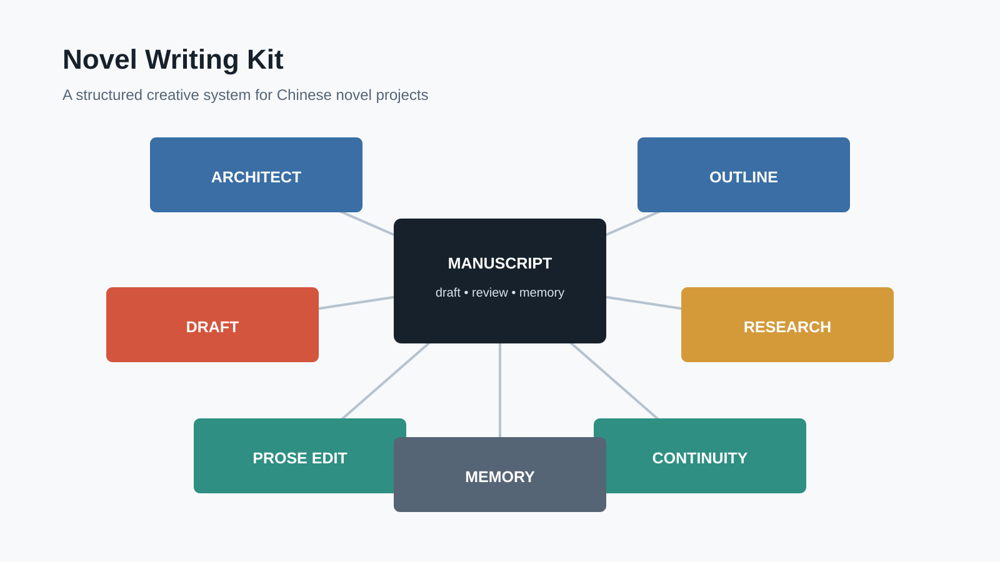

[English](README.md) | [简体中文](README.zh-CN.md)

# Novel Writing Kit

A Codex plugin for structured Chinese novel writing, also usable as a local skill collection in Claude.

## Core skills

- `novel-architect`: Establishes the story framework, character system, world rules, timeline, and creative constraints.
- `novel-outline`: Turns a premise into coherent arcs, volumes, chapters, scenes, conflicts, and hooks.
- `novel-draft`: Produces and revises Chinese novel prose while preserving motivation, viewpoint, and scene continuity.
- `novel-continuity`: Audits characters, chronology, rules, resources, information gaps, injuries, and foreshadowing.
- `novel-prose-edit`: Refines Chinese expression, dialogue, rhythm, repetition, tone, and AI-like phrasing.
- `novel-research`: Verifies historical, geographic, institutional, medical, military, and technical details on demand.
- `novel-memory`: Maintains state cards, progress, hook ledgers, summaries, and context compression across sessions.

`novel-orchestrator` is an optional router for multi-step tasks.

## Usage

- Use a single core skill for a focused task.
- Use `novel-orchestrator` for multi-step workflows.
- Explicitly invoke a skill such as `$novel-draft` when deterministic routing is preferred.

See [`plugins/novel-writing-kit/docs/routing.md`](plugins/novel-writing-kit/docs/routing.md) for the routing contract.

## Workflow at a glance

The kit follows a controlled creative loop: define the story foundation, design the plot, draft the chapter, verify facts when needed, edit the prose, audit continuity, and update project memory. Focused tasks can use one skill directly; multi-step tasks can use the optional orchestrator.

Workflow diagrams and image-generation prompts are collected in [`docs/visual-prompts.md`](plugins/novel-writing-kit/docs/visual-prompts.md).

## Scope and privacy

This repository contains no character samples, private chats, real-person profiles, or fixed novel setting. Add those only in your own novel project.

## License and provenance

Released under the MIT License; see [`LICENSE`](LICENSE). Source reorganization, privacy exclusions, and adaptation notes are documented in [`PROVENANCE.md`](PROVENANCE.md). Contributions are covered by [`CONTRIBUTING.md`](CONTRIBUTING.md).
