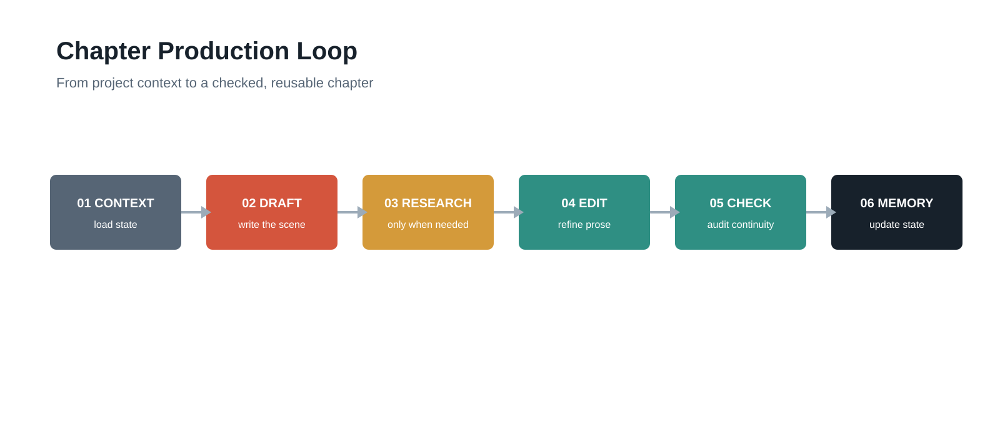
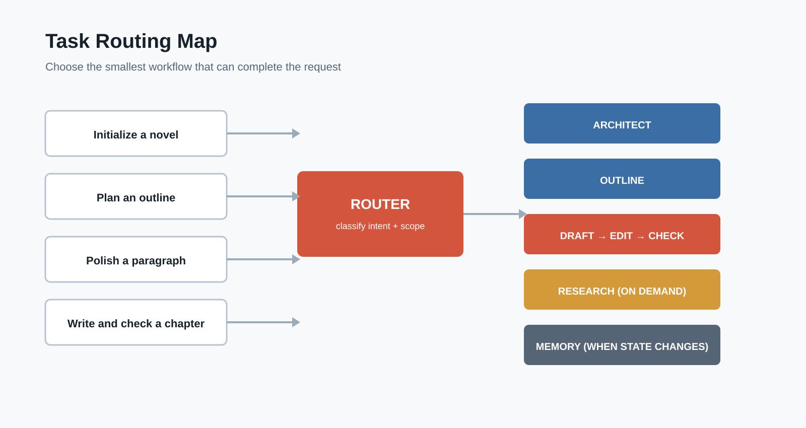
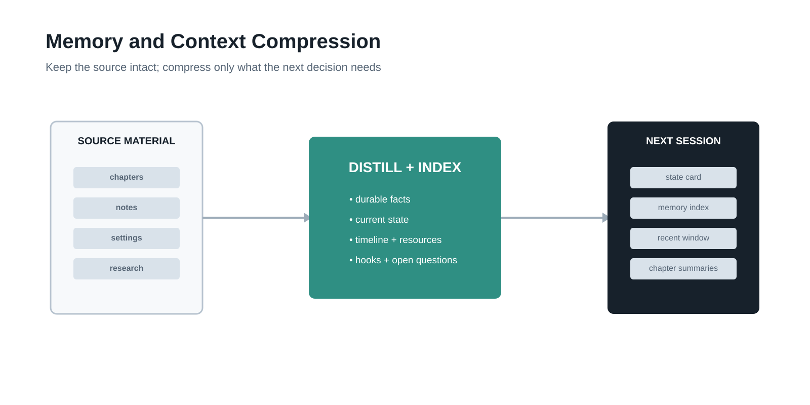
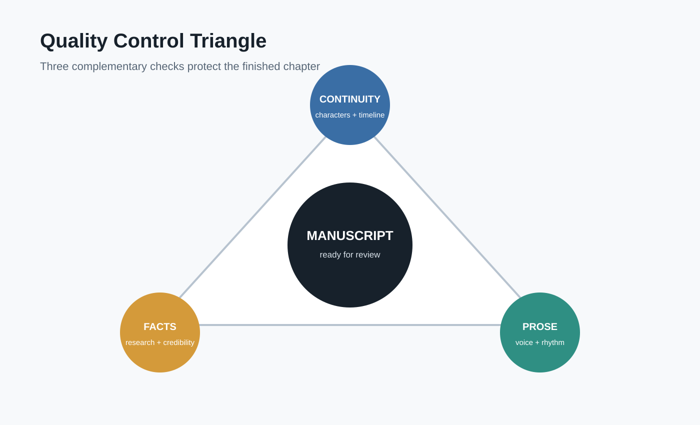

# Workflow Visual Prompts

## 1. Overall Architecture

**用途**：Novel Writing Kit 是一套分工明确的中文小说创作系统。

## 2. Chapter Production Loop

**用途**：单章从准备到交付的完整流程。

## 3. Task Routing Map

**用途**：简单任务和多步骤任务如何选择 skill。

## 4. Memory and Context Compression

**用途**： `novel-memory` 如何把长篇内容转成可持续使用的项目记忆。

## 5. Quality Control Triangle

**用途**：正文生成后的三类质量保障。

